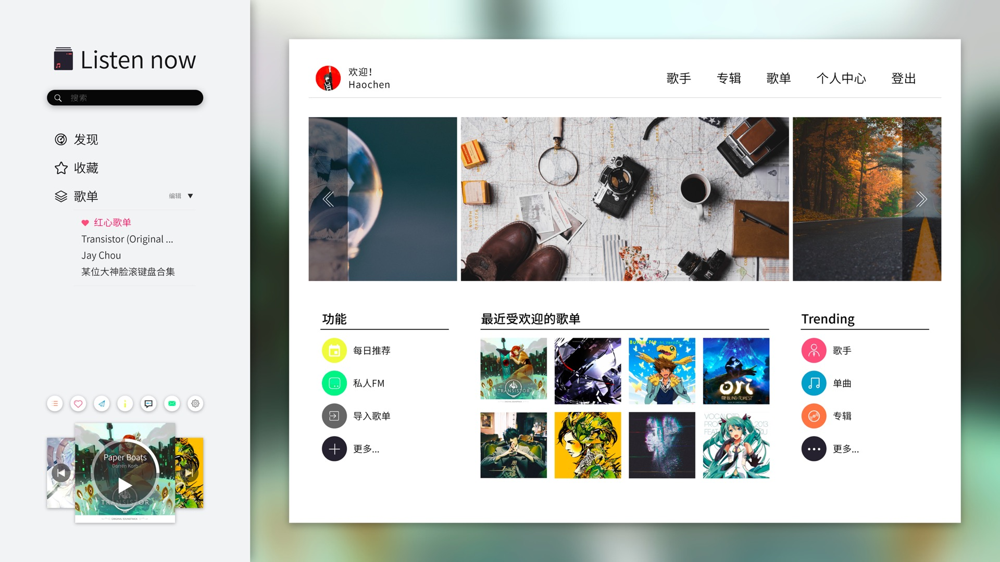

# Listen-now




## 邮件列表
Listen-now开源项目公开的邮件列表地址为：listen-now-email@googlegroups.com
欢迎将你遇到的问题直接反馈到该地址。你的邮件将很快会得到回复。

## 版本升级历史

```
    * 0.1.0   上线网易云播放(搜索, id播放)
    * 0.2.0   上线QQ音乐、虾米音乐(搜索, id播放)
    * 0.3.0   上线README.md 详细说明, 启用Redis 一级缓存加快服务器响应
    * 0.5.0   上线测试终端版Listen-now(pymusic), 启用mongodb储存用户信息, 同步歌单
    * 0.5.1   优化后台响应, 启用异步IO设计, 启用代理ip设置
    * 0.5.3   终端版本支持单曲循环功能, 支持播放歌单, 支持随机播放热门歌曲(手气不错)
    
    * 1.0.0   [版本大更新]
              重新构建项目结构，采用了Python标准项目结构设计
              新增包管理模式，使开源更简单
              重构返回统一的json数据格式
              重新上线网易、QQ、虾米音乐(支持关键字搜索和id获取)
              优化redis缓存
              更新SDK-开发者文档
    
    * 1.1.0   启用登录注册模块，修复部分bug并返回歌曲热门评论
    * 1.2.0   启用token参数用于服务器访问，控制请求频率，一定程度上解决中间人攻击

    * 1.5.0   初步支持新的三个音乐平台：百度（千千）音乐、酷狗音乐、酷我音乐
    * 1.5.2   开发Spotify音乐平台，暂时因为Spotify不向国内提供服务，而没有启用。
```
## 简要说明

这是一个目前支持七大(网易、虾米、QQ、百度[千千]、酷狗、酷我、Spotify)音乐平台的Python后端系统, 它可以被部署在服务器上, 接受相关请求, 返回相应音乐的地址、歌词、演唱者等更多信息.

目前他提供多个版本，

1. 部署于服务器上的后端API；
2. 直接在terminal使用的终端听歌版本；
3. listen-now团队设计的web版本；

本项目后台系统在以下环境中编写并成功运行。
请注意，暂时不提供Windows版本。

```
Python 3.6.4
CentOS 7.0/Mac OS 10.13.4
Redis
uwsgi
Nginx

更多开发者文档指引请参看docs 目录

```

## 使用指南

[1. pymusic 使用指南](https://github.com/listen-now/listen-now/blob/master/README/pymusic-readme.md)

[2. API搭建版本](https://github.com/listen-now/listen-now/blob/master/README/API-readme.me)

[3. docker免配置版本](https://github.com/listen-now/listen-now/blob/master/README/docker-readme.me)

## 如何参与贡献？

[参与贡献指南](https://github.com/listen-now/listen-now/blob/master/CONTRIBUTING.md)


